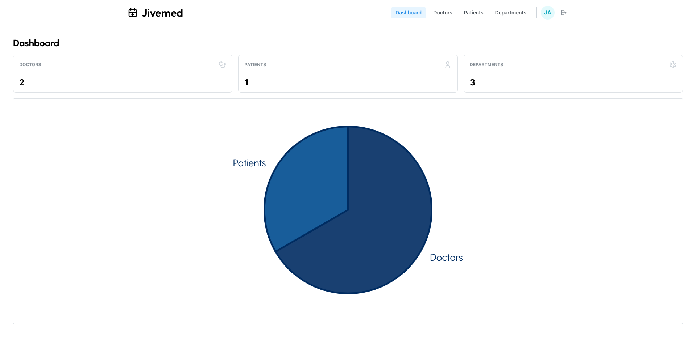
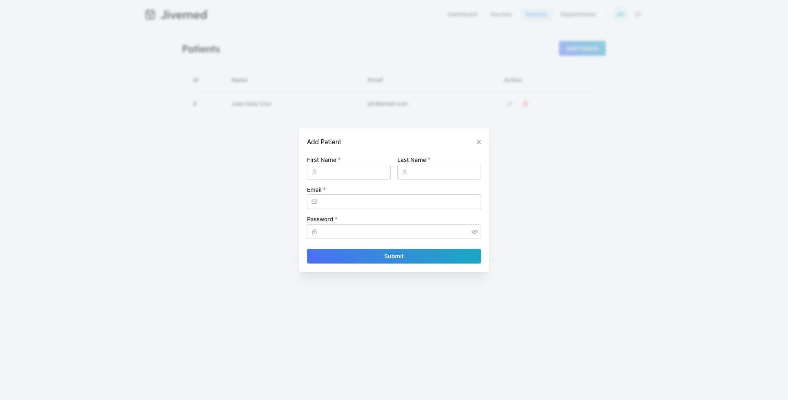
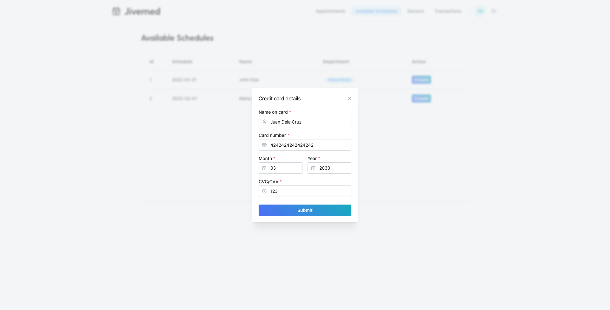
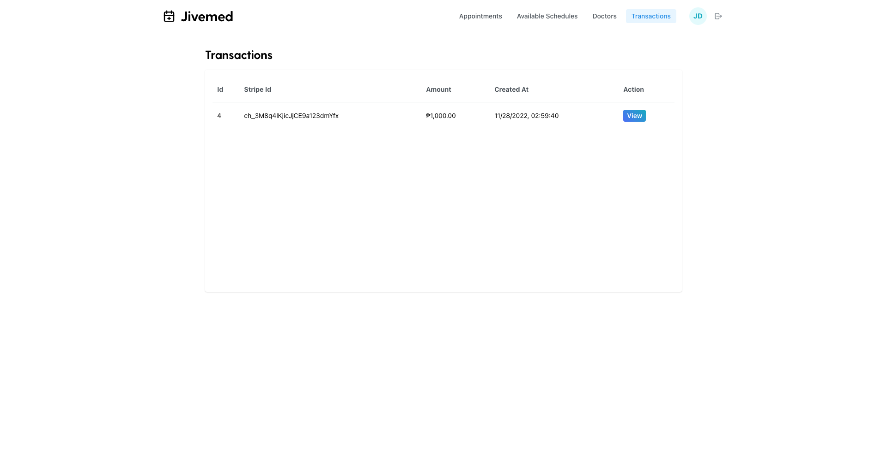
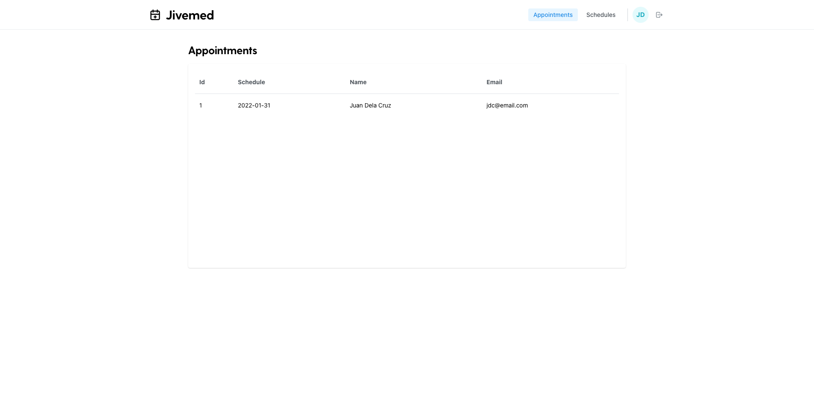
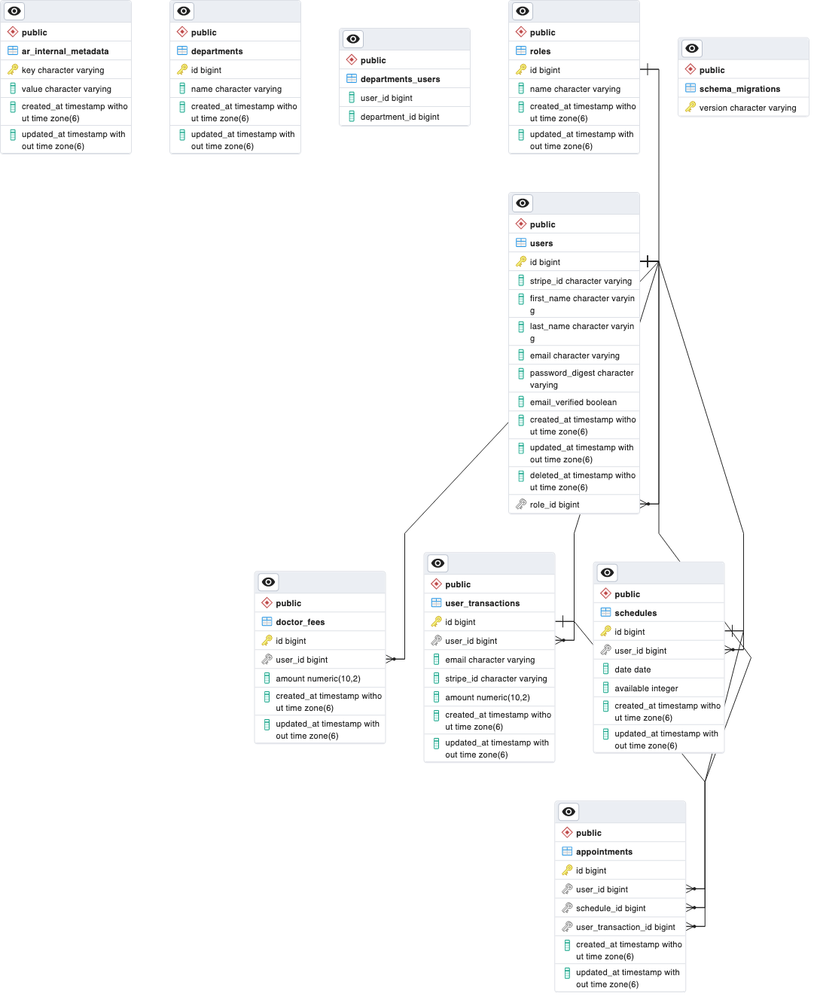

# rails-jivemed

This project is an application that allows users to create hospital appointments.

## Tech Stack

- Ruby on Rails
- React
- Stripe API

## Features

### Admin

- Create doctor and patient accounts.
- Create doctor departments.

### Doctor

- Create available schedules for appointments.
- View all scheduled appointments.
- View all patients.
- Update doctor department.

### Patient

- Create an account to create hospital appointments.
- Receive an email to confirm pending account signup.
- View all doctors.
- View all transactions made by setting up appointments.

## Test Accounts

### Admin

- `email: jivemed.admin@email.com`  
  `password: 123456`

### Doctor

- `email: jd.doctor@email.com`  
  `password: 123456`

- `email: mdc.doctor@email.com`  
  `password: 123456`

### Patient

- `email: dc@email.com`  
  `password: 123456`

## ERD

## Live Demo

https://react-jivemed-426p.onrender.com

## Frontend Repo

https://github.com/grenzk/react-jivemed
